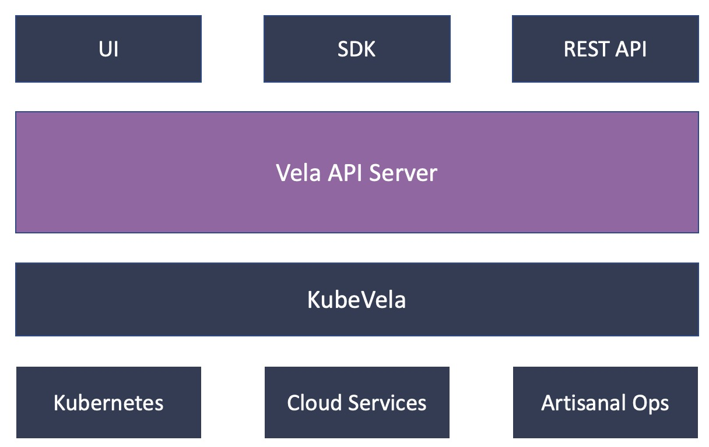
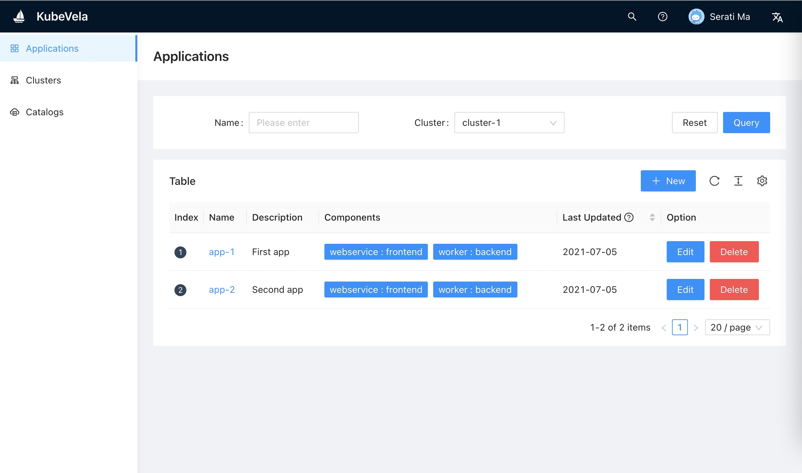

# velacp

## Overview

KubeVela control plane (velacp) includes the UI/CLI and HTTP server components to provide application and cluster management experience based on KubeVela & K8s.

This project is based on the following tech stacks:

- [Protobuf](https://developers.google.com/protocol-buffers/docs/gotutorial)
- Golang and [Echo](https://echo.labstack.com/)
- React and [Ant Design Pro](https://pro.ant.design/)



## Quickstart

Download server [releases](https://github.com/oam-dev/velacp/releases).

Or build server binaries yourself:

```
mkdir -p _bin/
make
```

Setup a mongodb instance. Check the [official doc](https://docs.mongodb.com/guides/server/install/).

Start velacp server:

```bash
_bin/velacp server --db-url=${MONGO_URL} --db-name=vela
```

The dashboard will be served at http://localhost:8000 .



## Community

- Slack:  [CNCF Slack](https://slack.cncf.io/) #kubevela channel (*English*)
- Gitter: [oam-dev](https://gitter.im/oam-dev/community) (*English*)
- [DingTalk Group](https://page.dingtalk.com/wow/dingtalk/act/en-home): `23310022` (*Chinese*)

## Contributing
Check out [CONTRIBUTING](./CONTRIBUTING.md) to see how to develop with KubeVela.

## Report Vulnerability

Security is a first priority thing for us at KubeVela. If you come across a related issue, please send email to security@mail.kubevela.io .

## Code of Conduct
KubeVela adopts [CNCF Code of Conduct](https://github.com/cncf/foundation/blob/master/code-of-conduct.md).
