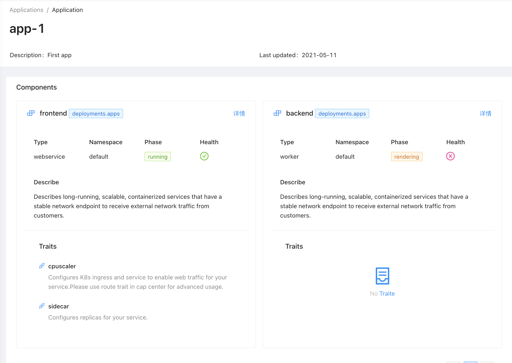

# velacp

KubeVela control plane (velacp) includes the UI/CLI and HTTP server components to provide application and cluster management experience based on KubeVela & K8s.

## Architecture

This project is based on the following tech stacks:

- [Protobuf](https://developers.google.com/protocol-buffers/docs/gotutorial)
- Golang and [Echo](https://echo.labstack.com/)
- React and [Ant Design Pro](https://pro.ant.design/)
- Mongodb


## Quickstart

Build cli and server binaries:

```
mkdir -p _bin/
make
```

Setup a mongodb instance. Check the [official doc](https://docs.mongodb.com/guides/server/install/).

Start velacp server:

```bash
_bin/velacp server \
    --db-url=${MONGO_URL} \
    --db-name=vela
```

The dashboard will be served at http://localhost:8000 .

### Cluster


### Application




