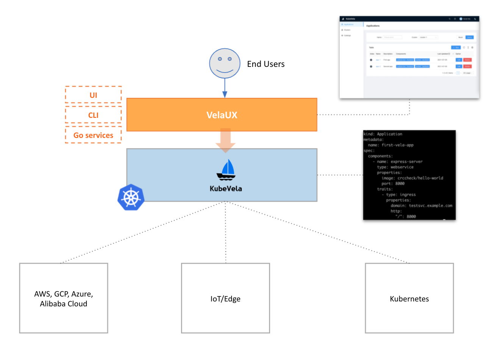
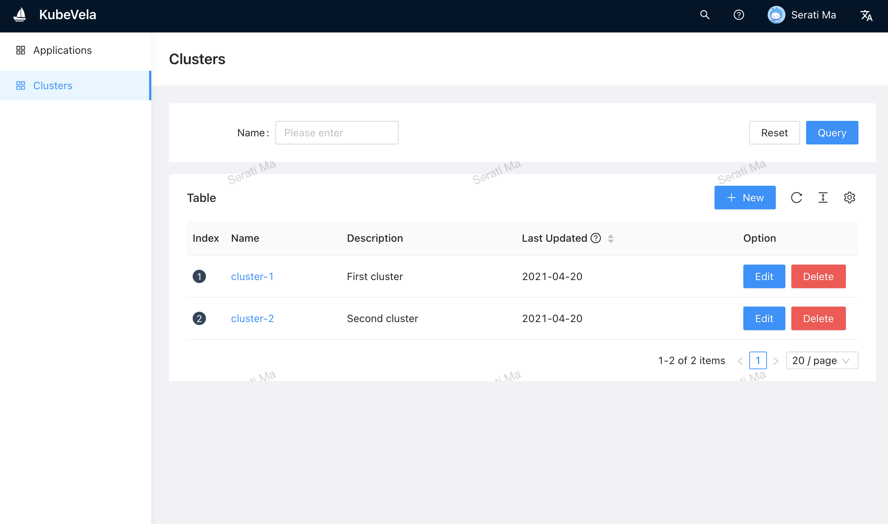
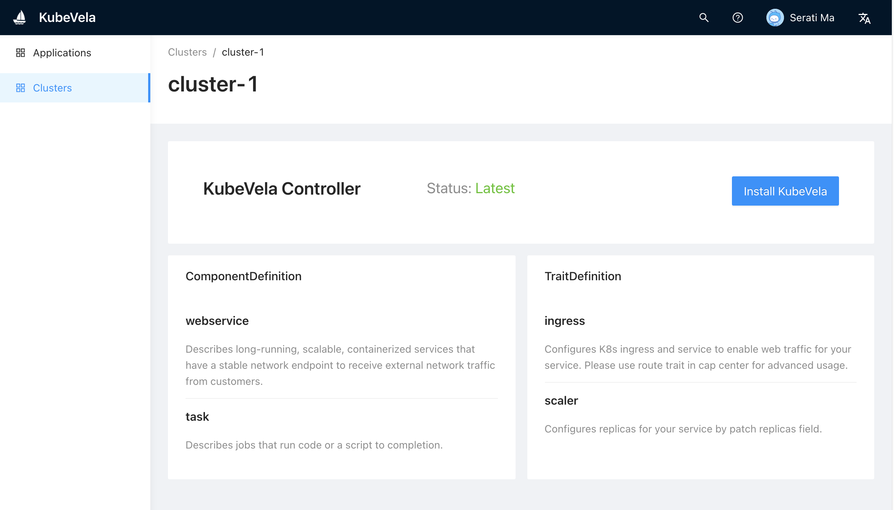
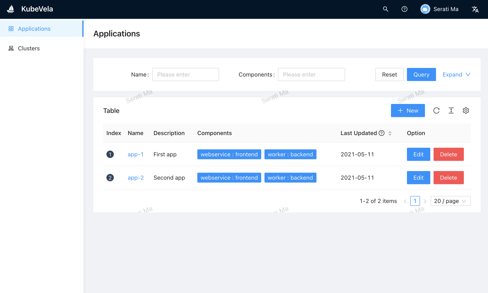
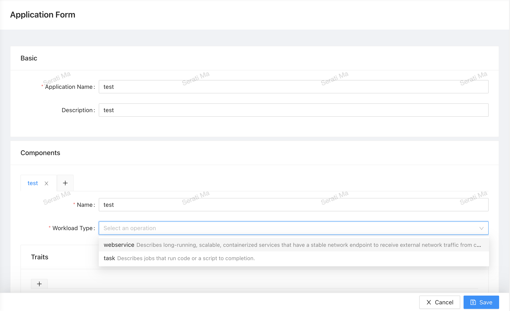

# velacp

KubeVela control plane to manage hybrid multi-cloud clusters,
provide plug-and-play capability management,
create stream-line application delivery pipelines.

## Architecture

This project is based on the following tech stacks:

- grpc
- mongodb
- ant-design-pro



## Quickstart

Build cli and server binaries:

```
mkdir -p _bin/
make
```

Setup a mongodb instance. Check the [official doc](https://docs.mongodb.com/guides/server/install/).

Start velacp server:

```bash
_bin/velacp server \
    --db-url=${MONGO_URL} \
    --db-name=vela
```

The dashboard will be served at localhost:8000 .

### Cluster




### Application




### Environment

TODO: UI

### Catalog

The catalog repo has a standard structure format in order to be managed in Vela Control Plane.

See [catalog-example](https://github.com/hongchaodeng/catalog-example) repo for more details.

TODO: UI
