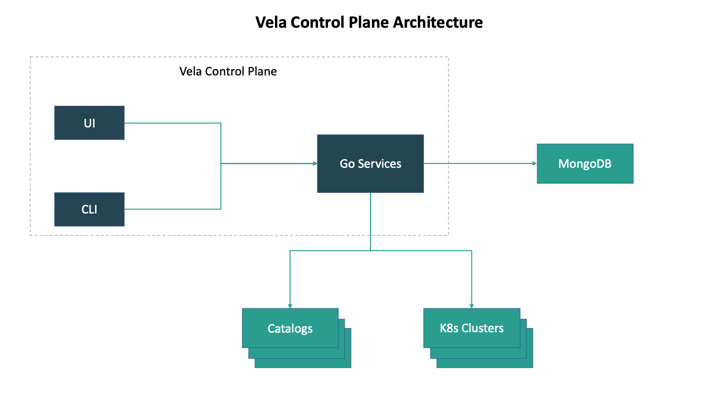

# velacp

KubeVela control plane to manage hybrid multi-cloud clusters,
provide plug-and-play capability management,
create stream-line application delivery pipelines.

## Architecture

This project is based on the following tech stacks:

- grpc
- mongodb
- ant-design-pro



## Quickstart

Build cli and server binaries:

```
mkdir -p _bin/
make
```

Setup a mongodb instance. Check the [official doc](https://docs.mongodb.com/guides/server/install/).

Start velacp server:

```bash
$ _bin/velacp server \
    --db-address=${MONGO_ADDRESS} \
    --db-name=${MONGO_DATABASE} \
    --db-user=${MONGO_USER} \
    --db-password=${MONGO_PASSWORD}
1.612156394424596e+09	info	grpcapi/grpcapi.go:57	grpc server is running on	{"port": 9000}
1.612156394424962e+09	info	grpcapi/grpcapi.go:81	http server is running on	{"port": 9001}
```

Use velactl to add catalogs

```bash
$ _bin/velactl catalog put test --desc "First catalog"
$ _bin/velactl catalog put test2 --desc "Second catalog"
```

Use velactl to list catalogs:

```bash
$ _bin/velactl catalog list
{
  "catalogs": [
    {
      "id": "ca11c2b3-fdb5-4fac-9888-3085c883ed70",
      "name": "test",
      "desc": "First catalog",
      "created_at": 1612124041,
      "updated_at": 1612124041
    },
    {
      "id": "8274ccb8-3b8b-4650-84c5-1c721d839bd9",
      "name": "test2",
      "desc": "Second catalog",
      "created_at": 1612124041,
      "updated_at": 1612124041
    }
  ]
}
```

(Optional) Verfy the data in mongodb:


## Start dashboard

Run:

```bash
$ cd ui/
$ yarn
... download dependencies ...

$ yarn start
Starting the development server...
```

### Cluster


### Application


### Environment

TODO: UI

### Catalog

The catalog repo has a standard structure format in order to be managed in Vela Control Plane.

See [catalog-example](https://github.com/hongchaodeng/catalog-example) repo for more details.

TODO: UI
